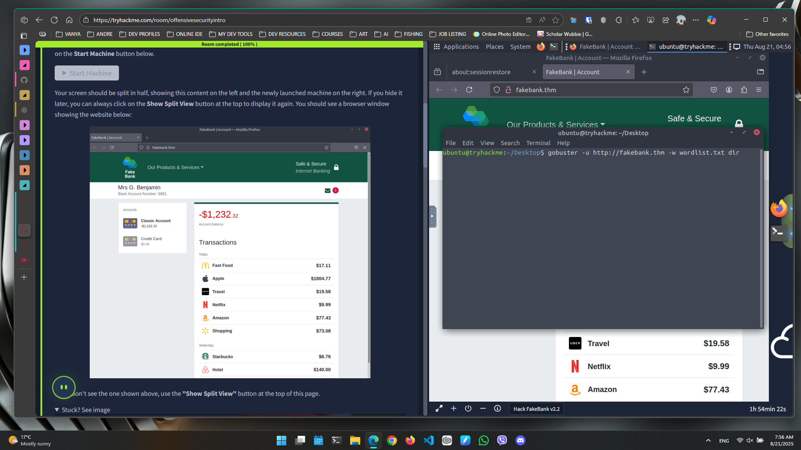
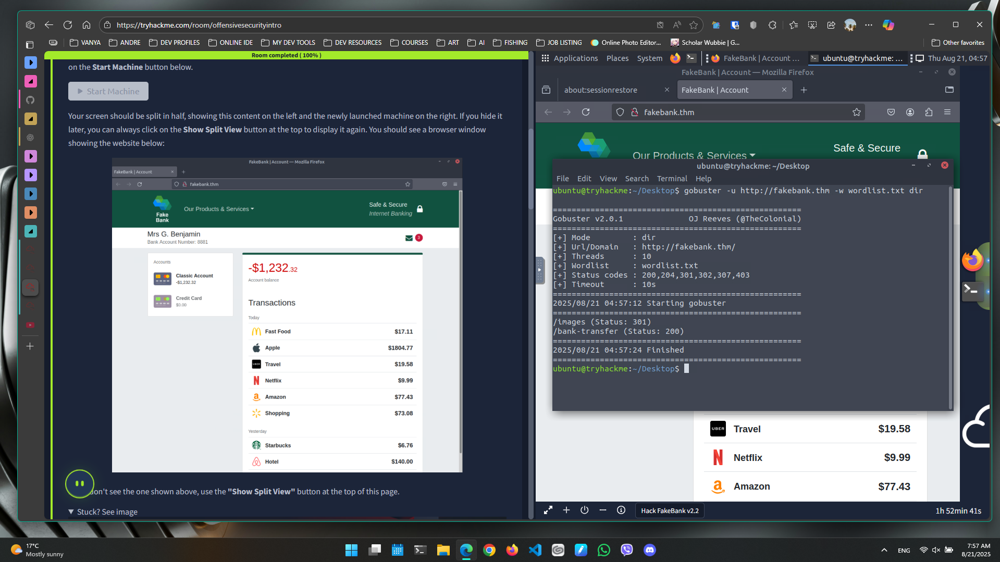

<section class="hero">
  <h6 align="Center">PS &mdash; 01</h6>
  

    <h2>
      Introduction to Cyber Security
    </h2>
    

      Welcome to <strong>Pre Security</strong>, the <strong>Introduction to Cyber Security</strong> section of the course, this sections notes cover, <strong><a href="#offensive-security-intro">Offensive</a></strong>, <strong><a href="#defensive-security-intro">Defensive</a></strong> & <strong><a href="#careers-in-cyber">Careers</a></strong> within Cyber Security.
    

  

</section>

### • Offensive Security Intro
#### **Task 1** &mdash; What is Offensive Security?
**_"To outsmart a hacker, you need to think like one."_** 
This is the core of Offensive Security. It involves breaking into computer systems, exploiting bugs in software and finding loopholes within applications that can be exploited to grant unauthorized access. Offensive Security's goal is to understand a hackers tactics to benefit our own systems against attacks.

 

#### **Task 2** &mdash; Hacking your first machine
In this section we will be simulating a hack, our target being Fakebank, while using a CLI tool known as **Gobuster** to brute-force Fakebanks website to see the hidden web pages. **Gobuster** will take a list of potential page or directory names and try accessing a website with each result, if the page exists, it will tell you.

Our first step is to open the terminal, also known as the Command Line Interface, CLI for short, We going to explore Gobuster. Most companies have an admin portal page, which in turn gives staff access to basic admin controls for day to day use, as in transferring money to and from accounts. 

Due to human error, some of these pages are not made private, allowing attackers to find hidden pages that show or give access to hidden pages. To simulate this, we will use Gobuster to find any hidden pages by inputting the command `gobuster -u http://fakebank.thm -w wordlist.txt dir`.

In the command above, -u is used to state the website we're scanning, -w takes a list of words to iterate through to find hidden pages.

After running said command, Gobuster will give us some results as shown below. Pages that are accessible are indicated by the status code 200.

Now that we have found the admin portal page that allows us to transfer money between accounts and we can connect to `http://fakebank.thm/bank-transfer` we as ethical hackers who have permission, would report this to the bank.

### Defensive Security Intro

### Careers in Cyber